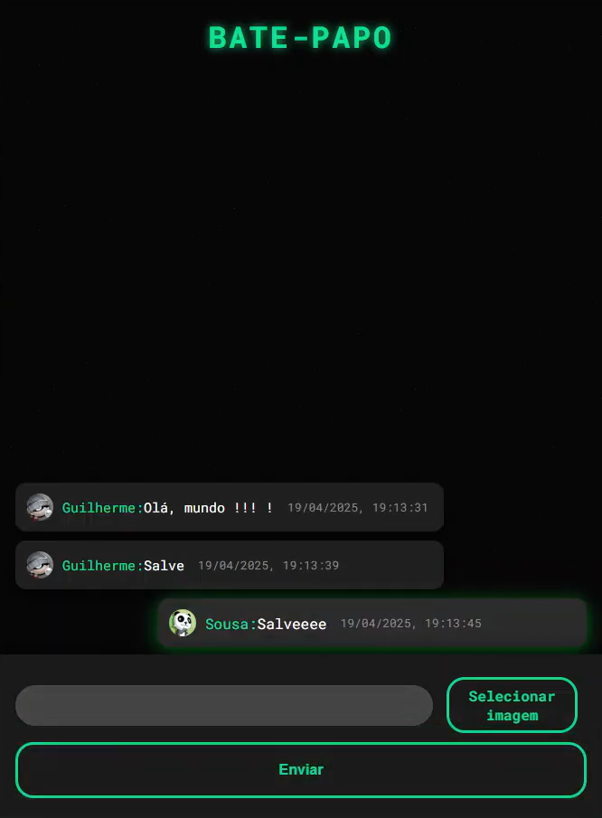

# Bate-papo ao vivo!!

<div>
    </img>
</div>


Este é um projeto de **chat em tempo real** desenvolvido utilizando **HTML**, **CSS** e **JavaScript** puro, com **Firebase** para gerenciar a autenticação e as mensagens. O chat permite que os usuários se conectem e troquem mensagens instantaneamente.


##  Como funciona

1.  Ao acessar o site, o usuário será solicitado a **informar um nome de exibição**.
2.  Em seguida, o usuário escolherá entre **4 avatares predefinidos** para representar sua identidade no chat.
3.  Com o nome e avatar escolhidos, o usuário estará pronto para interagir no chat em tempo real com outros usuários.
4. Veja o vídeo do <b>Chat Tempo Real</b> funcionando: <a href="https://www.youtube.com/watch?v=APGqs0_CUeM">Clique aqui</a>

##  Tecnologias usadas

-   **Firebase Realtime Database**: Para o armazenamento e sincronização em tempo real das mensagens.
-   **Firebase Authentication**: Para gerenciar a autenticação do usuário.
-   **HTML**, **CSS** e **JavaScript**: Para o desenvolvimento da interface e funcionalidade do chat.

##  Como rodar o projeto

Para rodar este projeto localmente, siga os seguintes passos:

### 1. Clone este repositório:

```bash
git clone https://github.com/uguisousa/ChatTempoReal.git
```
### 2. Crie um projeto no Firebase

1. Acesse o <a href="https://console.firebase.google.com/u/0/">Firebase Console</a>.
2. Crie um novo projeto no console.
3. Após criar o projeto, vá até as <b>Configurações do Projeto</b> clicando no ícone de engrenagem no canto superior esquerdo.
4. Na seção `Configurações do Firebase > SDK do Firebase para Web`, você encontrará as credenciais necessárias para a configuração do seu Firebase.

### 3. Configure as credenciais do Firebase no Projeto
1. Abra o arquivo `index.js` localizado no seu projeto.
2. No arquivo `index.js`, você verá um trecho onde deverá adicionar suas credenciais do Firebase. Substitua as informações do Firebase com as credenciais do seu próprio projeto.

```
// substitua com suas próprias credenciais do console do Firebase :]
var firebaseConfig = {
    apiKey: "",
    authDomain: "",
    databaseURL: "",
    projectId: "",
    storageBucket: "",
    messagingSenderId: "",
    appId: "",
    measurementId: ""
};
```

## Contribuições
Contribuições são bem-vindas! Sinta-se à vontade para abrir issues ou enviar pull requests.
